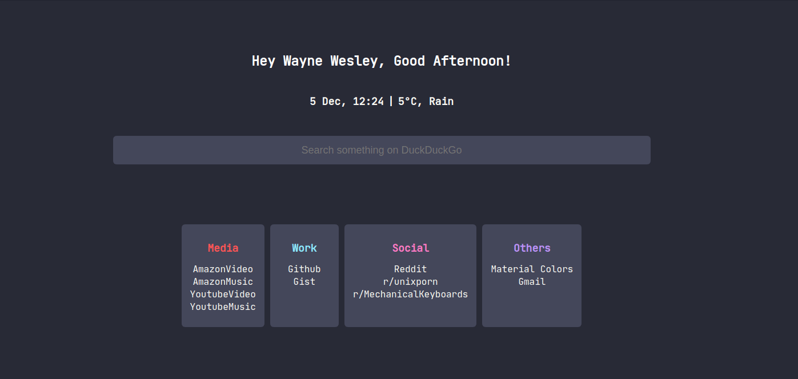

<h1>Minimal Startpage</h1>
<h4>Just another minimal startpage for browsers.</h4>

<h3>
<a href="https://github.com/The-Repo-Club/StartPage/wiki/Chrome">Chrome Installation</a> | <a href="https://github.com/The-Repo-Club/StartPage/wiki/Firefox">Firefox Installation</a> | <a href="https://github.com/The-Repo-Club/StartPage/wiki/Configuration">Configuration</a>
</h3>

